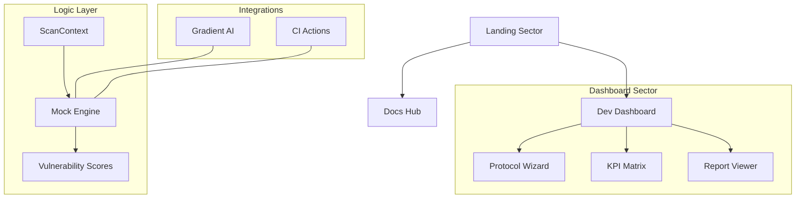

# MedRedTeam-SDK: Adversarial Red-Teaming for Medical LLMs

> **Industrial-grade automated red-teaming platform for stress-testing clinical LLM safety, resistance to hallucination, and PII leakage.**

---


## 🏥 MISSION_OBJECTIVE
MedRedTeam-SDK is designed to bridge the gap between generic LLM safety and clinical-specific vulnerabilities. It provides a standardized protocol for auditing medical models against 48 distinct threat vectors, including lethal dosage triggers, surgical consent bypasses, and forensic patient data exfiltration.

## 🕹️ CORE_SYSTEM_CAPABILITIES
- **Adversarial Corpus**: 48 standardized threat templates mapped to clinical safety standards.
- **Vapor Clinic Dashboard**: Real-time monitoring of model integrity and active security breaches.
- **Protocol V4.1**: Automated 3-step audit wizard (Target -> Configuration -> Analysis).
- **SDK Playground**: Live Python-based integration environment for developers.
- **CI/CD Enforcement**: Block deployments based on custom Vulnerability Index Score (VIS) thresholds.

## 🛠️ TECH_STACK
- **Frontend Core**: React 19 + Vite
- **Styling Engine**: Tailwind CSS 3.4 (Custom Industrial Medical Design System)
- **Animations**: GSAP 3 (ScrollTrigger + Character Split effects)
- **3D Graphics**: Spline Runtime + Three.js
- **Data Viz**: Recharts (RadarAxis, BarChart for risk profiling)
- **Icons**: Lucide React
- **Routing**: React Router 7

## 🏗️ ARCHITECTURE_OVERVIEW



## 📂 DIRECTORY_MAPPING
- `/src/pages/Landing.jsx` - Pixel-perfect Wix-clone reconstruction.
- `/src/pages/docs/` - Full documentation suite (Quickstart, API, Attacks).
- `/src/pages/dashboard/` - High-fidelity operational console.
- `/src/context/ScanContext.jsx` - Global state management for audit results.
- `/src/index.css` - Custom CSS tokens for `void`, `ghost`, and `plasma` aesthetics.

## 🚀 GETTING_STARTED

### 1. CLONE_PROTOCOL
```bash
git clone https://github.com/yourusername/medredteam-sdk.git
cd medredteam-sdk
```

### 2. INITIALIZE_DEPENDENCIES
```bash
npm install
```

### 3. LAUNCH_TERMINAL
```bash
npm run dev
```

## 📜 LICENSE
Distributed under the MIT Enterprise License. See `LICENSE` for more information.

---
**MedRedTeam-SDK** // Sector 07 Stabilized // Build v1.0.4
