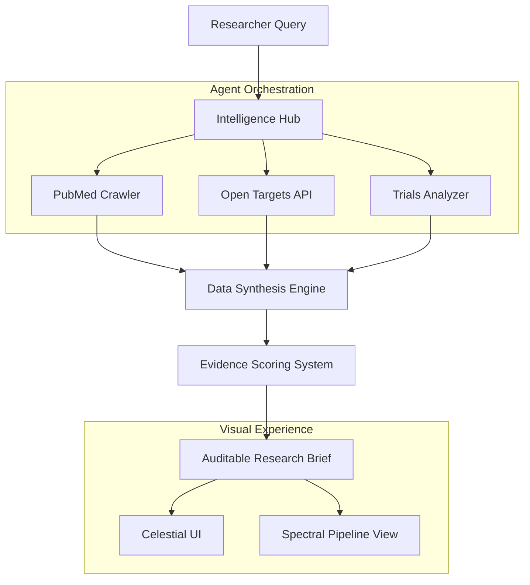

# NexusRx: Multi-Agent Drug Discovery Intelligence Platform

> **Accelerate drug discovery by compressing weeks of manual search into minutes using specialized AI agents.**

---


## 🧬 MISSION_OBJECTIVE
NexusRx is an industrial-grade intelligence platform that deploys a coordinated fleet of AI agents to crawl, synthesize, and audit the global landscape of pharmaceutical research. By integrating PubMed, Open Targets, and ClinicalTrials.gov, NexusRx provides researchers with structured, auditable research briefs, evidence strength ratings, and clinical trial white-space analysis in under 90 seconds.

## 🚀 CORE_CAPABILITIES

### 🤖 Multi-Agent Intelligence Pipeline
NexusRx utilizes a proprietary multi-agent architecture where specialized agents handle distinct stages of the intelligence gathering process:
- **Literature Agent**: Mines 35M+ PubMed abstracts for high-impact biological signals.
- **Target Agent**: Queries Open Targets for druggability scores and safety/toxicity flags.
- **Trial Agent**: Analyzes the ClinicalTrials.gov landscape for competitive "white-space" and protocol designs.
- **Synthesis Agent**: Aggregates disparate data points into a cohesive, peer-review-ready research brief.
- **Quality Agent**: Audits citations and assigns an "Evidence Strength Index" (ESI) to every finding.

### 🌐 Immersive Research Interface
The platform features a "Void & Plasma" design system built on high-performance WebGL shaders:
- **Celestial Sphere**: An interactive star-field representing the vast landscape of global research.
- **Spectral Flow**: A dynamic "data stream" shader representing the real-time agent pipeline.
- **Hero Odyssey**: A stylized lightning-path shader representing the breakthrough "Eureka" moment in discovery.

## 🏗️ SYSTEM_ARCHITECTURE



## 🛠️ TECH_STACK
- **Frontend Core**: React 19 + Vite
- **State Management**: React Context (ScanContext) for real-time pipeline tracking.
- **Styling Engine**: Vanilla CSS + Tailwind (Custom "Industrial Bio" Theme)
- **Advanced Visuals**: Three.js & Custom GLSL Shaders
- **Animations**: GSAP 3 (Scroll-orchestrated) & Framer Motion
- **Icons**: Lucide React
- **Icons**: Phosphor Icons (for specific bio-medical utility)

## 📂 REPOSITORY_STRUCTURE
- `/src/components/ui/` - High-performance WebGL shader components (Celestial, AnoAI, Odyssey).
- `/src/pages/Landing.jsx` - Core landing page featuring integrated shader backgrounds and scroll-linked animations.
- `/src/pages/docs/` - Full developer documentation suite.
- `/src/context/ScanContext.jsx` - Centralized coordinator for agent states and literature results.

## 🏁 GETTING_STARTED

### 1. CLONE_REPO
```bash
git clone https://github.com/Vilsee/nexusrx-intelligence-hub.git
cd nexusrx-intelligence-hub
```

### 2. INSTALL_DEPENDENCIES
```bash
npm install
```

### 3. RUN_DEV_SERVER
```bash
npm run dev
```

### 4. PRODUCTION_BUILD
```bash
npm run build
```

## 📜 LICENSE
Distributed under the MIT Enterprise License.

---
**NexusRx** // Sector 07 Stabilized // Build v1.2.0
